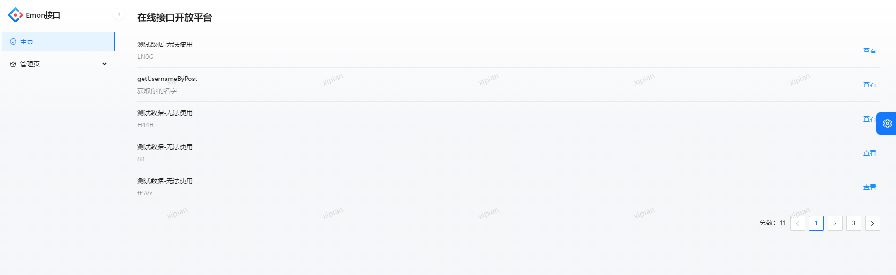
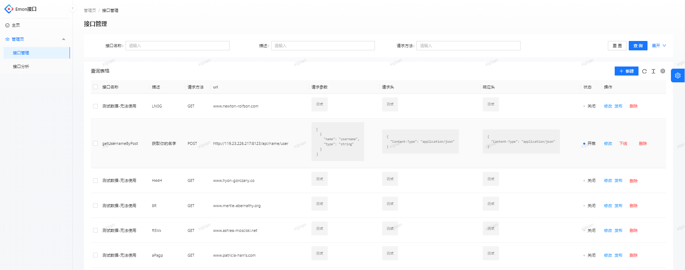
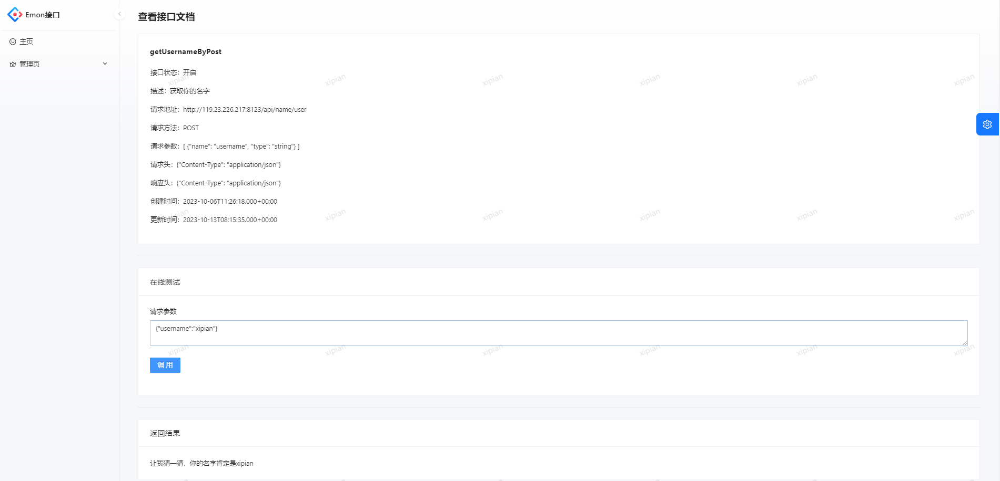
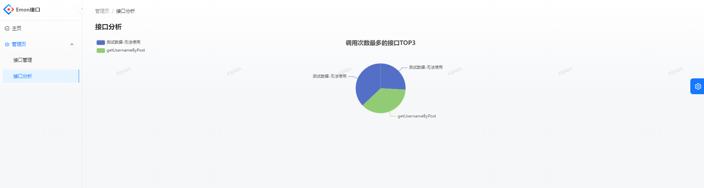
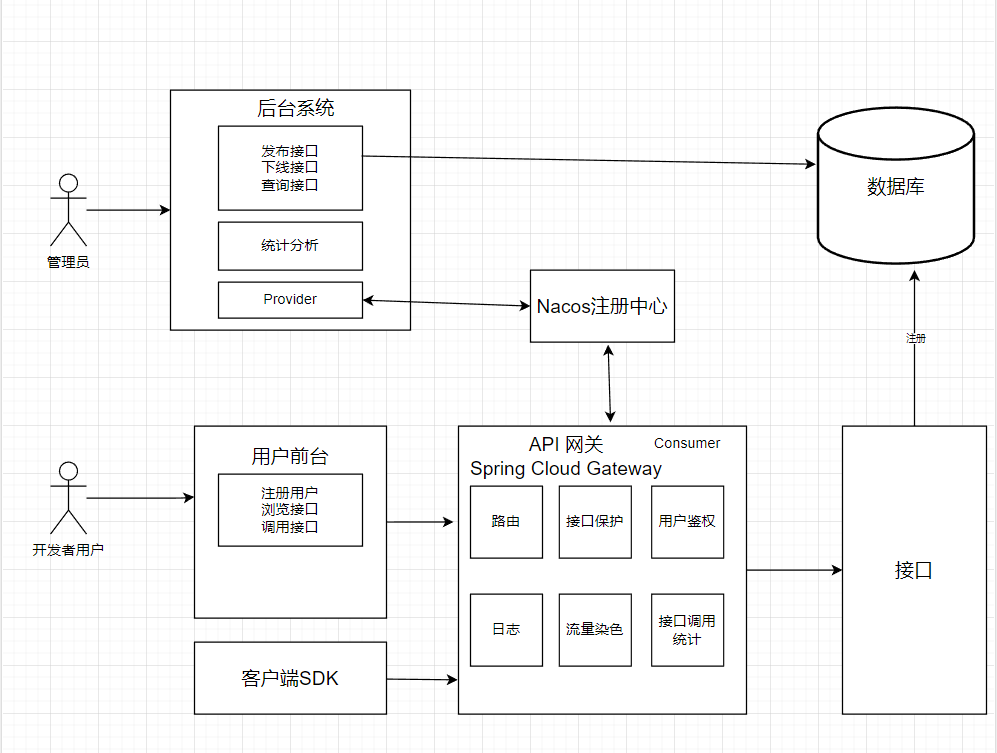

# 1.项目介绍

基于React + Spring Boot + Dubbo + Spring Cloud GateWay 的 API 接口开放调用平台

- 普通用户：注册登录，在线测试调用接口，通过客户端 SDK 简单调用接口
- 管理员： 调用统计和可视化分析接口调用情况，发布接口、下线接口

主要功能：

- API接入
- 网关
- 防止攻击（安全性）
- 不能随便调用（限制、开通accessKey/secretKey）
- 统计调用次数

主页（浏览接口）：

接口管理：

在线调试：

接口数据：

# 2.项目架构图

# 3.技术选型

后端：

- Spring Boot
- MySQL数据库，MyBatis Plus + MyBatis X + Lombok 快速开发
- Spring Boot Starter (SDK开发)
- Dubbo RPC 框架，结合 Nacos 实现远程调用
- Spring Cloud Gateway (路由，鉴权，流量染色，接口统计，日志)
- Swagger + Knife4j (接口文档生成)
- Hutool 等工具库

# 4.启动项目

后端：

1. Maven install emonapi-client-sdk 项目
   > 客户端SDK，无端口，发送请求到8090端口，由网关进行转发到后端的接口服务地址
   > 由于测试调用接口服务使用到了SDK,需要install到本地仓库

2. Maven install emonapi-common 项目
   > 公共的model和service

3. 启动 Nacos (版本2.2.3)
   > 注册中心，结合 Dubbo 使用

4. 启动 emonapi-backend 项目
   > 7529端口，后端接口管理，接口文档：http://localhost:7529/api/doc.html

5. 启动 emonapi-gateway 项目 
   > 8090端口，网关

6. 启动 emonapi-interface 项目
   > 8123端口,暂时提供测试的接口服务，目前只是简单的测试作用，未来可以添加各种接口服务
   
# 5.其他

- 前端：可以通过 接口文档，开发前端调用后端（OpenAPI规范）
- 项目结构：emonapi-client-sdk，emonapi-common，emonapi-gateway，emonapi-interface 项目都放在了emonapi-backend项目目录下
- 建表 sql 在/sql目录下

# 6.更新
......